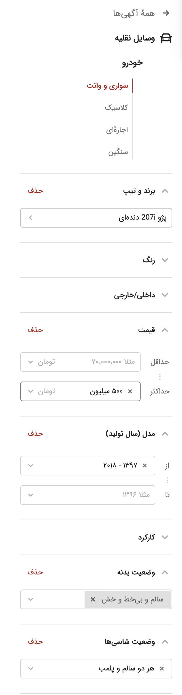

# Divar Car Ads Scraper and Telegram Notifier

## Overview
Are you tired of constantly refreshing the Divar website to check for new listings of a specific product? Our Divar Car Scraper and Telegram Notifier is here to simplify your life. Just provide the link to the product category you're interested in, along with any specific filters you desire, set up your Telegram bot, and enjoy! You'll get real-time updates directly in your Telegram chat, ensuring you never miss out on a great deal.

This project is a Python script designed to scrape car listings from the Divar website (a classified ads platform in Iran), specifically for a certain price range and production year. The script continuously monitors the website for new listings and sends the details of each new car found to a specified Telegram chat via a bot.

## Features
- **Data Scraping**: Extracts car data, including images and details, from Divar's car section.
- **Telegram Integration**: Sends notifications with car details to a specified Telegram chat.
- **Continuous Monitoring**: Runs indefinitely, checking for new listings every 10 minutes.

## Prerequisites
- Python 3.x
- BeautifulSoup4
- requests
- A Telegram bot token and chat ID (refer to [Telegram Bot API](https://core.telegram.org/bots/api))

## How To Use?
### Step 1: Set Your Filters
just go to [Divar](https://divarir) website and select every filters that you want like image below:

### Step 2: Capture the Filtered URL
 after selecting filters, you'll have a link in your browser like this:

https://divar.ir/s/iran/car/peugeot/207i/manual?price=-500000000&production-year=1397-&body_status=intact&chassis_status=both-healthy&cities=1764%2C1%2C866%2C14%2C15%2C671%2C19%2C1722%2C1721%2C1739%2C1740%2C850%2C1751%2C2%2C1738%2C1720%2C1753%2C1752%2C774%2C1754

### Step 3: Integrate with the Script
replace the link inside the source code with your customized link.

### Step 4: Set Up Your Telegram Bot
Create new telegram bot via [BotFather](https://t.me/botfather)

Follow the provided instructions to create the bot and secure your bot token. Subsequently, insert the bot token into the designated section of the script.

### Step 5: Obtain Your Chat ID
Send a message to your bot with your account, Then open this url.

[Chat id](https://api.telegram.org/bot[Your bot token]/getUpdates)

Locate your chat ID within the JSON response and embed it in the script's relevant section.

Congratulations! You're all set. With these steps completed, the Divar Car Ads Scraper and Telegram Notifier is primed to keep you informed about the latest and most enticing car deals on Divar. Happy deal hunting!